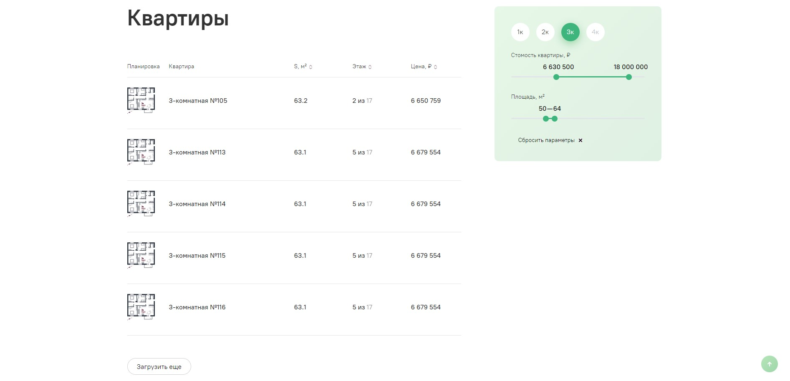

# Тестовое задание Kelnik

### Необходимо сверстать список квартир с фильтром.

#### Макет

https://www.figma.com/file/4epBThlWhT5iGKKMNBPSN2/%D0%A2%D0%B5%D1%81%D1%82%D0%BE%D0%B2%D0%BE%D0%B5-%D0%B4%D0%BB%D1%8F-%D1%84%D1%80%D0%BE%D0%BD%D1%82%D0%B0?node-id=0%3A1

#### Шрифт

https://www.paratype.ru/fonts/pt/pt-root-ui

#### Требования

##### Вёрстка

- HTML5.
- Код должен быть валидным.
- Подключить уникальные шрифты (PT Root UI).
- Адаптивная верстка (приложены макеты для брейкпоинтов 960+ и 1440+).
- Максимальная ширина контентной части сайта 1440px. На мониторах шире контент центрируется.
- Кроссбраузерная верстка. Страница должна одинаково смотреться в современных браузерах и не разваливаться в EDGE и Safari.
- Нельзя использовать CSS фреймворки (Bootstrap, Foundation).
- Помнить о всех возможных состояниях элементов формы (:hover, :active).

##### Javascript

- Можно использовать плагин для ползунков фильтра.
- Реализовать работу кнопки “Наверх”. При клике должна произойти плавная прокрутка вверх страницы. Если прокрутка не возможна, то кнопка скрывается.
- Реализовать работу фильтра. При изменении состояния необходимо блокировать изменение фильтра и отправлять запрос на сервер. (XHR/AJAX/fetch на ваше усмотрение). Поднимать бэкенд составляющую не нужно, достаточно json файла, откуда будете тянуть данные.
- При клике на кнопку “Показать ещё 20” показать еще 20 карточек квартир. Кнопка должна скрываться, когда данные на сервере или в файле заканчиваются. (XHR/AJAX/fetch на ваше усмотрение). Поднимать бэкенд составляющую не нужно, достаточно json файла, откуда будете тянуть данные.

##### Преимуществом будет

- Семантическая вёрстка.
- Использование любого препроцессора (SASS, LESS, Stylus).
- Использование системы сборки проекта (Webpack, Gulp, Grunt).
- Использование систему контроля (Git).
- Использование методологии (BEM, MCSS, SMACSS).
- Использование шаблонизаторов HTML (Pug(Jade), Twig, Handlebars, HAML).
- Не забывайте о доступности.
- Оптимизация

---

### Stack:

- JS
- HTML5
- SASS
- GULP
- BEM

Ссылка на GitHub Pages - https://phildesign.github.io/kelnik-test-task/
